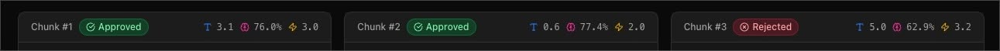

import EL from '@/components/ui/ExternalLink.astro';

We've implemented BM25 for keyword search, we also integrated our own semantic search by leveraging embeddings but the thing is: we still risk to pass irrelevant information to our LLM!

Reranking is a common practice that plenty of powerful search algorithms implement to improve their quality. If you don't trust me, just read the <EL href="https://www.elastic.co/docs/solutions/search/ranking">Elastic Docs</EL> about it.

In this exercise our task is to craft a new `generateObject` call that will take the results generated by both approaches and selects only the ids of the most relevant documents that are relevant to the query of our user.

All the code we will write lives inside `api/search.ts` and we're tasked to first analyze how it works.

> As funny as it gets, while our search lives inside the `api` folder, we will not call this directly. Instead, we will call `api/chunks.ts` that defines a GET endpoint looking at search params like `keywords` and `semantic`. Parameters that the user can fill via the `input`s he finds in our page.

Actually, the `searchChunks` function we define in `api/search.ts` get's called by the endpoint defined in `api/chunks.ts` **only if** it finds a `keywords` or `semantic` parameters passed to it.

When we call `searchChunks` we go over the same dance we have done in the previous lessons:
- we ran a BM25 search if `keywords` is present
- we ran a semantic search if `semantic` is present
- we take both results and combine them with the Reciprocal Rank Fusion (`reciprocalRankFusion`) function we created

But we will not stop there. As highlighted in the opening of this note, there is another step that we will implement in order to improve our results and it is by instructing our LLM into the selection of the most relevant resources our search found.

In the UI we will not exclude the resources that the LLM will not find relevant, we will ask the LLM to only return the IDs because Matt implemented an id-matching system that will show us a badge showing us if a chunk has been approved or not.



Now that we know what we will implement, let's dive into the **how** are we supposed to implement this reranking.

Based on the step list I wrote earlier, at this point in our `searchChunks` we have the the `rrfResults` array that has ordered all the chunks we found with both search approaches by their score.

We then generate a `topResultsForReranking` array slicing by the amount of chunks we want to consider for this operation:
```ts
const topResultsForReranking = rrfResults.slice(
  0,
  opts.rerankCount,
);
```
Once we have this smaller array, we then re-map it introducing an `id` prop based on the position of the chunk itself:
```ts
const topResultsWithId = topResultsForReranking.map(
  (result, i) => ({
    ...result,
    id: i,
  }),
);
```
To improve the lookup of the selected chunks, we then generate a `Map` with these:
```ts
const topResultsAsMap = new Map(
  topResultsWithId.map((result) => [result.id, result]),
);
```
This `Map` will be helpful to generate the list of approved chunks, but now let's focus on how we implement the `generateObject` in order to let the LLM identify the most relevant resourced based on our search.

First and foremost, we will need to prepare our prompt generating the string for the `searchQuery` the user has used (by combining the `keywords` used for the BM25 search as well as the `semantic` string):
```ts
const searchQuery = [
  opts.keywordsForBM25?.join(' '),
  opts.embeddingsQuery,
]
  .filter(Boolean)
  .join(' ');
```
> Here we use `keywordsForBM25` and `embeddingsQuery` from `opts` because this is the configuration object we pass from `api/chunks.ts`.

Next we need to generate a string with some formatting that will help the LLM understand when a chunk starts and ends as well as the related `id`. And we can do that with this simple loop:
```ts
const chunksWithId = topResultsWithId
  .map((result) =>
    [
      `## ID: ${result.id}`,
      `<content>`,
      result.chunk,
      `</content>`,
    ].join('\n\n'),
  )
  .join('\n\n');
```
Now that we have the additional parameters we can provide to our `prompt`, it's time to leverage the `generateObject` function to invoke the power of the LLM:
```ts
const rerankedResults = await generateObject({
  model: google('gemini-2.5-flash-lite'),
  system: `
		<role>You are an helpful assistant capable of selecting the most relevant chunks from a provided list based on a query.</role>
		<rules>
			- you MUST compare each resource with the propted query
			- ALWAYS return only the id of the selected chunk
			- NEVER include chunks that are not relevant or only tangentially related to the user query
		</rules>
		<action>
			Here's the user query, match only the most relevant chunk
		</action>
	`,
  schema: z.object({
    resultIds: z.array(z.number()),
  }),
  prompt: `
  	Search query: ${searchQuery}

   	Available chunks: ${chunksWithId}

   	Return only the IDs of the most relevant chunks for the user's search query.
  `,
});
```
As you can see, the most relevant part of this invocation are the content we provide to `system` and `prompt`. These most likely will be the most relevant implementation of **any** of the instructions you want to provide to an LLM:
- with `system` you set the base behavior for the LLM. You can define which role it has to cover, set boundaries about its process and explain the output you are expecting from it. In the example above you see also leveraging some tags to help me define boundaries to help the LLM understand when starts and ends a specific instruction.
- with `prompt` instead you define the real question that we want an answer from. In this case we repeated the request of returning only the IDs, this had been done more as a safeguard and is helping older model not to hallucinate, but it is preferred to delegate the validation to the `schema` and set a clear `system`.

On a last note here, remember that we are using a generalist LLM to rerank our resources but if we plan to bring this feature into production probably is a good idea to leverage specific models trained just for this scope. Matt's advice is the <EL href="https://cohere.com/rerank">cohere Rerank</EL> model.

That's it! We now have implemented the reranking to our results so our user will get better answers.
