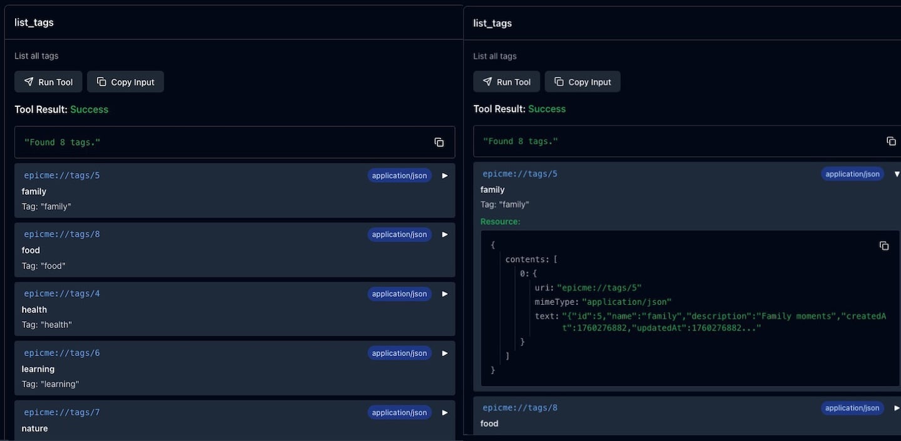

As we discovered in the previous lesson, by declaring a resource we expose different capabilities that allows the LLM to access or expose those resources, but they will have hard times to work with them.

That's because with a standard resource an LLM is only able to know which of them are available and/or display them.

If you want to have a tool that interacts with such resources we have to integrate the latter with the first one, and this is doable thanks to our ability to specify the result of each tool.

The MCP gives us two types of result that allow us developer to "teach" the LLM on how we want it to interact with the resources:
- [**Resource Links:**](https://modelcontextprotocol.io/specification/2025-06-18/server/tools#resource-links) in case a tool needs to provide additional context or data it can link to a resource.
- [**Embedded Resources:**](https://modelcontextprotocol.io/specification/2025-06-18/server/tools#embedded-resources) in this case the LLM will directly embed the resource in the response if it needs to provide additional context or data.

## Step 1: Embedded Resources
In our [tools lesson](/notes/master-mcp/lesson/tools) we defined a `get_entry` tool able to retrieve an entry from its `id`, but we also have a resource `entry` that mostly does the same thing. 

Let's embed the resource directly.

If you remember the `registerTool` signature, after the `name` string and the `config` object, we have to implement the callback function that's in charge of returning the result of our tool call.

What the callback `return`s will always be an object with a `content` key that holds an array of objects, since we're embedding a resource inside `get_entry`, this time the object will have a structure able to describe to the LLM what the resource it is about.

> In this case, we will provide the same `entry` as we did in the standard tool call but we will also provide more information about the resource itself

Let's see how we designed the tool at first:
```ts
agent.server.registerTool(
  'get_entry',
  {
    title: 'Get Entry',
    description: 'Get a journal entry by ID',
    inputSchema: entryIdSchema,
  },
  async ({ id }) => {
    const entry = await agent.db.getEntry(id)
    invariant(entry, `Entry with ID "${id}" not found`)
    return {
      content: [{ type: 'text', text: JSON.stringify(entry) }],
  },
)
```
At first our `content` was quite simple, an array containing a single object that passes a `type: 'text'` shape and where `text` is just the stringifyed version of the response we get from our database.

To embed the resource we will do almost the same thing, we still query the database to get the appropriate resource, but this time we will let the tool know that we're using a resource and we will provide all the details inside a `resource` key.
```ts
agent.server.registerTool(
  'get_entry',
  {
    title: 'Get Entry',
    description: 'Get a journal entry by ID',
    inputSchema: entryIdSchema,
  },
  async ({ id }) => {
    const entry = await agent.db.getEntry(id)
    invariant(entry, `Entry with ID "${id}" not found`)
    return {
      content: [
        {
          type: 'resource',
          resource: {
            uri: `epicme://entries/${id}`,
            mimeType: 'application/json',
            text: JSON.stringify(entry),
          },
        },
      ],
    }
  },
)
```
As you can see, inside the `resource` object we provide:
- `uri` the same URI we provided in our resource definition
- `mimeType` the type of response the client will expect
- `text` the actual response provided by our resource that the tool can leverage
### But wait, `mimeType` is not the same type as `text`!
If you're like me, you noticed pretty soon that with `mimeType` we're specifying that the kind of data we are passing to the LLM via our tool is JSON, still inside `text` we pass a string 😮

That's nothing to get crazy about, **LLM only works with string** for both input and output.

Since the only way we can pass something to an LLM is via converting it to a string, we use `JSON.stringify` to transform the `entry` object into a string.

But at the same time we need tell the LLM how to treat such string. In the end it could be a simple string, a MarkDown file, a JSON structure or any other type of content you can imagine...

That's why we specify a `mimeType`, we need to inform the LLM about how to use the kind of content we're sending.

## Step 2: Linked Resources
In some cases, our resource is so big that we do not want to include it all in our tool response. We have the ability to link them and let the LLM decide if it wants to load them or not.

As soon as we opened the exercise file, we discover that for both the listing functions of tags and entries the approach was the same as above. We tell our `list_entries/list_tags` that we have a `resource` and we want to embed it.
```ts
agent.server.registerTool(
  'list_tags',
  {
    title: 'List Tags',
    description: 'List all tags',
  },
  async () => {
    const tags = await agent.db.getTags()
    const tagLinks = tags.map((tag) => {
      return {
        type: 'resource',
        resource: {
          uri: `epicme://tags/${tag.id}`,
          mimeType: 'application/json',
          text: JSON.stringify(tag)
        }
      } satisfies ResourceContent
    })
    return {
      content: [createText(`Found ${tags.length} tags.`), ...tagLinks],
    }
  },
)
```
This is the **exact** same thing we did in the previous exercise.

Since we could have hundreds of entries, and each could be incredibly long, instead of filling the context of our LLM we decide that's better to show a simple title that links to a specific resource. Then the LLM will be able to decide what to do with it. 

In order to do so we need to change the `return` inside our `map`s. 

In case you noticed the changes present in the various `content` arrays that each callback `return`, wait for the deep at the end because Kent has done a terrific job in teaching us how to better organize our code.

To complete this lesson, the first change we have to make is to tell that we're not returning an object with the type of `resource`, instead we aim to return a `resource_list`.

Changing the type of our object requires also **a different structure**, one where we do not have a `resource` key describing our resource, instead we can define every key right at the same level.
```ts
agent.server.registerTool(
  'list_tags',
  {
    title: 'List Tags',
    description: 'List all tags',
  },
  async () => {
    const tags = await agent.db.getTags()
    const tagLinks = tags.map((tag) => {
      return {
        type: 'resource_link',
        uri: `epicme://tags/${tag.id}`,
        name: tag.name,
        description: `Tag: "${tag.name}"`,
        mimeType: 'application/json',
      } satisfies ResourceContent
    })
    return {
      content: [createText(`Found ${tags.length} tags.`), ...tagLinks],
    }
  },
)
```
So now our `tagLinks` array will be an array of `resource_link` objects where we can tell the LLM the exact `uri` for the specific resource, its `name` and `description` and, as we discovered a while ago, we can specify the `mimeType` so the LLM know how to treat the resource.

Running this example inside our MCP Inspector show us a different interface:

The inspector is able to understand that we're generating a list of resources and it allow us also to dive deeper and discover its content by clicking on the URI.

### A little note on code organization
I believe that there is no doubts that Kent is a great developer, but you notice it even with the little things on how he does what he does.

For example, the [repository](https://github.com/epicweb-dev/mcp-fundamentals/tree/main) for this course, had an interesting improvement between the Tools lesson and the following.

Beside the transformation from functional programming into object oriented, that I already highlighted in my previous note, some **utility functions** has started to pop out. 

The first one was `createText`, a simple function that takes a single argument and decide how to output the string.
```ts
function createText(text: unknown): CallToolResult['content'][number] {
	if (typeof text === 'string') {
		return { type: 'text', text }
	} else {
		return { type: 'text', text: JSON.stringify(text) }
	}
}
```
Why did Kent created it?

Well, so now we do not have to write an entire object every time we need to add it to our `content`. Check by yourself:
```ts
// Before
agent.server.registerTool(
	'add_tag_to_entry',
	{
		title: 'Add Tag to Entry',
		description: 'Add a tag to an entry',
		inputSchema: entryTagIdSchema,
	},
	async ({ entryId, tagId }) => {
		const tag = await agent.db.getTag(tagId)
		const entry = await agent.db.getEntry(entryId)
		invariant(tag, `Tag ${tagId} not found`)
		invariant(entry, `Entry with ID "${entryId}" not found`)
		const entryTag = await agent.db.addTagToEntry({
			entryId,
			tagId,
		})
		return {
			content: [
				{
					type: "text",
					text: `Tag "${tag.name}" (ID: ${entryTag.tagId}) added to entry "${entry.title}" (ID: ${entryTag.entryId}) successfully`,
				},
				{
					type: "text",
					text: JSON.stringify(tag),
				},
				{
					type: "text",
					text: JSON.stringify(entry),
				},
			],
		}
	},
)

// After
agent.server.registerTool(
  'add_tag_to_entry',
  {
    title: 'Add Tag to Entry',
    description: 'Add a tag to an entry',
    inputSchema: entryTagIdSchema,
  },
  async ({ entryId, tagId }) => {
    const tag = await agent.db.getTag(tagId)
    const entry = await agent.db.getEntry(entryId)
    invariant(tag, `Tag ${tagId} not found`)
    invariant(entry, `Entry with ID "${entryId}" not found`)
    const entryTag = await agent.db.addTagToEntry({
      entryId,
      tagId,
    })
    return {
      content: [
        createText(
          `Tag "${tag.name}" (ID: ${entryTag.tagId}) added to entry "${entry.title}" (ID: ${entryTag.entryId}) successfully`,
        ),
        createText(tag),
        createText(entry),
      ],
    }
  },
)
```
That can seem a little win, but think about all the times you should write `{ type: 'text', text: '...' }`, isn't this kind of intelligent approaches that let you fell in love with programming in the first place?

But Kent didn't stop at creating `createText` function alone, he also introduced (for now at least) two other specific functions: `createEntryEmbeddedResource` and `createTagEmbeddedResource` that allow us, well him, to write even less code.
```ts
type ResourceContent = CallToolResult['content'][number]

function createEntryEmbeddedResource(entry: { id: number }): ResourceContent {
	return {
		type: 'resource',
		resource: {
			uri: `epicme://entries/${entry.id}`,
			mimeType: 'application/json',
			text: JSON.stringify(entry),
		},
	}
}

function createTagEmbeddedResource(tag: { id: number }): ResourceContent {
	return {
		type: 'resource',
		resource: {
			uri: `epicme://tags/${tag.id}`,
			mimeType: 'application/json',
			text: JSON.stringify(tag),
		},
	}
}
```
And you can argue all you want, and even improve upon these by creating a more general utility function like `createEmbeddedResource`. The point I'm trying to make here is that as developers **we need to think about this kind of approaches**.

We're not typing monkeys that just code all they long, we can think about **how to optimize our work** and IMO we have to do so.

Before moving on, if you're curious about how I would write the `createEmbeddedResource` function myself, this is what I would do:
```ts
function createEmbeddedResource(data: { id: number }, resource: string): ResourceContent {
	return {
		type: 'resource',
		resource: {
			uri: `epicme://${resource}/${data.id}`,
			mimeType: 'application/json',
			text: JSON.stringify(data),
		},
	}
}
```
Doing like this you'll have to call, and maintain, a single function that's able to create any kind of embedded resource like so:
```ts
agent.server.registerTool(
  // Standard config
  async ({ entryId, tagId }) => {
    // All the dance we did earlier to create `tag` and `entry` objects
    return {
      content: [
        createText(
          `Tag "${tag.name}" (ID: ${entryTag.tagId}) added to entry "${entry.title}" (ID: ${entryTag.entryId}) successfully`,
        ),
        // Replaced: createTagEmbeddedResource(tag),
        createEmbeddedResource(tag, 'tag'),
        // Replaced createEntryEmbeddedResource(entry),
        createEmbeddedResource(entry, 'entry')
      ],
    }
  },
)
```
I'm quite sure you can come up with something clever than having to pass a second `string` argument, but this is the reason I'm sharing my notes with such depth.

I want you to leverage this content to grow and elaborate by creating your own solutions.

And I'm pretty sure that's the same reason Kent does what he does as well.