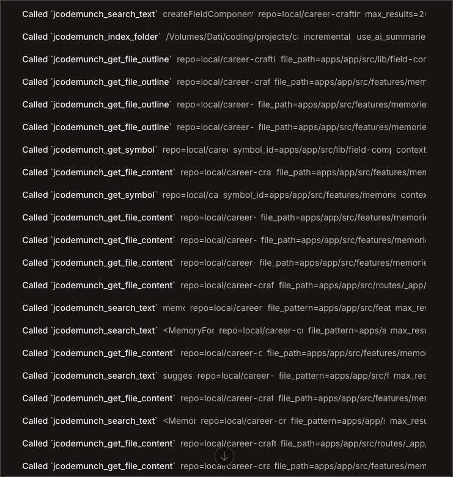

import EL from '@/components/ui/ExternalLink.astro';

After years of skepticism, AI agents are now central to my workflow. While I don’t delegate everything (I still prefer a collaborative approach where I maintain control), I chat with my agents constantly.

Every time you start a new session, it is like hiring a new coworker who is seeing your codebase for the first time. If you use a CLI-based agent, you are already ahead; the terminal is a powerful tool for discovery. However, there is a hidden cost: your agent must read and process the output of every `grep`, `ls`, or `cat` command it runs. This is a massive waste of tokens.

## The Problem: Inefficient Discovery
How does an agent "learn" your code? Usually, you provide a starting point: *"Hey, I want to implement a feature in this React component."*

The agent reads that component and its imports, loading relevant snippets into its context. But then it starts exploring. It runs `ls` to map the directory structure, then another `ls` on a `features` folder, and then `cat` on a `utils.ts` file just to see what is inside. Even "smart" agents that use `grep` often pull in more data than necessary.

This process is problematic for two reasons:

1. **Cost:** You pay for every redundant token consumed during discovery.
2. **Performance and Hallucination:** Bloated contexts lead to the "Lost in the Middle" phenomenon. Research shows that as context windows fill up (often reaching a tipping point at 50% capacity), models struggle to retrieve information located in the center of the prompt. Their understanding blurs, they miss critical details, and they begin to hallucinate.  

You might suggest session compression or asking the agent to summarize the conversation. While possible, these solutions are not free; you must pay to send the entire session to a model for summarization. 

Furthermore, you lose control over what the agent chooses to keep or discard.

## A Surgical Approach: O(1) Context Retrieval
I recently discovered a more efficient method: a Model Context Protocol (MCP) server that runs locally to provide `O(1)` optimization for code retrieval. 

Traditional discovery is `O(n)`, where the agent must linearly scan through files and directories to find what it needs. 

By indexing your codebase into a Tree-sitter AST (Abstract Syntax Tree), the MCP creates a direct map of your logic. Instead of "searching," the agent can jump directly to the exact function or class definition via a pointer. It is the difference between flipping through every page of a book and using a perfect index to find a specific paragraph.

For those using **OpenCode**, you can integrate the <EL href="https://github.com/jgravelle/jcodemunch-mcp">jCodeMunch MCP</EL> by adding this to your config:

```json
{
  "$schema": "https://opencode.ai/config.json",
  "mcp": {
    "jcodemunch": {
      "type": "local",
      "command": ["uvx", "jcodemunch-mcp"],
      "enabled": true
    }
  }
}
```

### "Inviting" Your Agent to Be Efficient

Simply installing the MCP is not enough. Agents often default to familiar tools like `ls` and `grep` because they do not instinctively know when to switch to a specialized index. In my tests, agents frequently ignored the MCP entirely, wasting tokens on standard CLI commands.

You should not disable `grep` or `ls` entirely, as they remain useful for various tasks. Instead, you should provide specific instructions in your `AGENTS.md` file to enforce a **Token-Saving Protocol**:

  
```markdown
## TOKEN-SAVING PROTOCOL (jCodeMunch)
1. **Discovery First:** ALWAYS use `get_repo_outline` or `get_file_outline` before reading file contents.
2. **Surgical Extraction:** NEVER use `read` for code files (TS, TSX, PY) if you only need specific logic. Use `get_symbol` to retrieve exact functions/classes.
3. **Hierarchy of Exploration:**
   - Map: `get_repo_outline` (Find where things are)
   - Blueprint: `get_file_outline` (Understand file structure)
   - Extract: `get_symbol` (Read the actual logic)
   - Fallback: `read` (Only for config, JSON, or non-code files)
```

## The Value of `⁠AGENTS.md`

Some <EL href="https://arxiv.org/abs/2602.11988">recent research</EL> has suggested that `AGENTS.md` files can actually degrade performance, leading some to claim the format is "dead." 

However, the issue is not the file itself; it is the poor quality of auto-generated `/init` drafts. 

When used intentionally to define tool hierarchies, these instructions are incredibly effective. 



Seeing an agent execute surgical tool calls instead of dumping entire files into the context is deeply satisfying and much cheaper. 

## Conclusion

This approach to codebase indexing is so effective that it will likely become a standard feature in AI clients. While proprietary versions exist (such as ChatGPT’s memory or Claude Code’s internal indexing), they create vendor lock-in. 

A local MCP server allows you to maintain a lean context across any agent or platform.

The numbers reported on the <EL href="https://j.gravelle.us/jCodeMunch/">project homepage</EL> are staggering. Since its release on March 3rd, this MCP has already saved users an estimated **14 billion tokens**, resulting in roughly **$350.000** in API costs.

How are you keeping your context lean? Have you experimented with codebase indexing yet? Let's <EL href="https://www.linkedin.com/feed/update/urn:li:activity:7435559755806371840/">discuss this on LinkedIn</EL> and share our best practices for agent efficiency.
